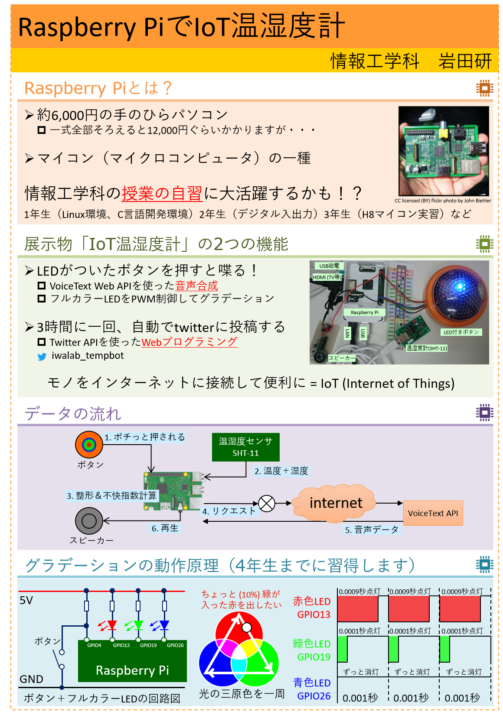

# raspberrypi-tempbot2

Raspberry PiでIoT温湿度計を作ってみました。
基本的には [raspberrypi-tempbot] と同じですが、デモに使うので一部見栄えをするものに変更しています。

## 機能
* スイッチを押すと喋る
VoiceText Web APIを利用させていただいています。
* フルカラーLEDでグラデーション
アノードコモンのフルカラーLEDをPWMで制御しています
* twitter自動投稿
トークンは適宜変更が必要です。

## 使い方
### ボタン機能
`nohup ./pwm.py &`
で実行しておけばフルカラーLEDが自動でグラデーションして、スイッチが押されると
1. 温度取得
2. 音声取得
3. スピーカー出力
をします。

### twitter-bot機能
`pi% sudo crontab -e`
を実行して
`02 */3  * * *   /home/pi/tempbot/sht-21.py`
を追加すればOKです。

## ポスター

